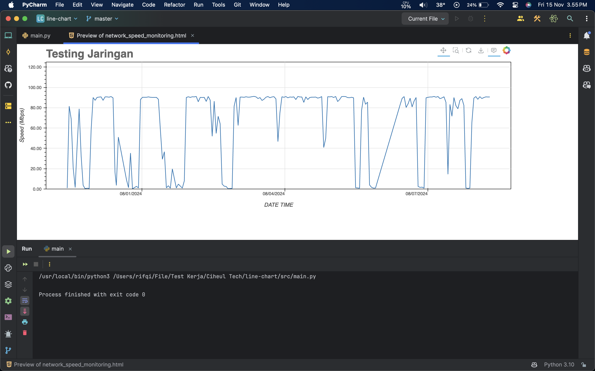
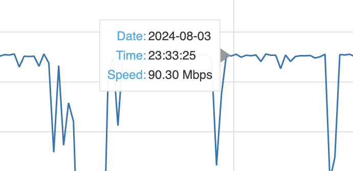

# Line Chart Display Using Bokeh

This project displays a line chart of speed data from a text file using Bokeh.

## Setup

1. **Create Virtual Environment**
    ```bash
    $ python3 -m venv venv
    $ source venv/bin/activate  # Windows: `venv\Scripts\activate`
    ```

2. **Install Required Packages**
    ```bash
    $ pip install bokeh pymupdf
    ```

3. **Run the Program**
    ```bash
    $ python src/main.py
    ```

   This will generate a `speed_chart.html` file with a line chart.

## Result





